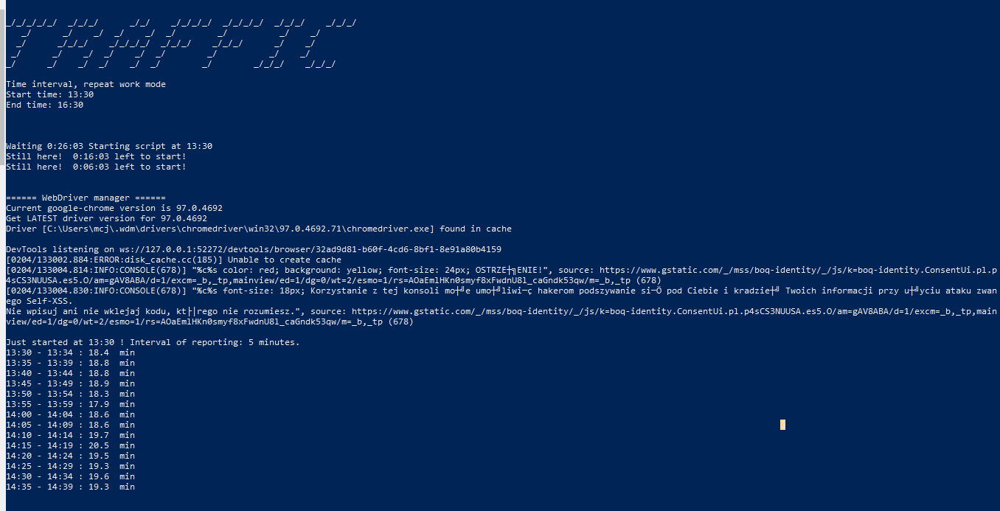
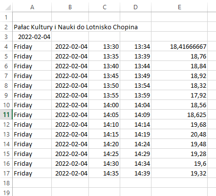

# Traffic Time - Google Maps Webscraper
> Webscraping commuting time from Google Maps for further analysis.

## Table of contents
* [General info](#general-info)
* [Screenshots](#screenshots)
* [Technologies](#technologies)
* [Setup](#setup)
* [Features](#features)
* [Status](#status)
* [Inspiration](#inspiration)
* [Contact](#contact)

## General info
Do you have flexible working hours but you are tired of traffic always just after you finish? Well, with this tool you can get informations when exactly travel time on your way home (or whatever road else) is in its peak.

The project uses Selenium to get lowest start-target commute time and saves averaged results in given interval in CSV file.

## Screenshots

## Technologies
* Python 3.7

## Setup
This project uses following packages:
* csv
* datetime
* shutil
* selenium
* time
* webdriver_manager.chrome

Other requirements include installed Google Chrome and, of course, Python (3.7 or higher) environement along with all required packages.
The application is meant to be used with polish Google Maps, as well as decimal separator is comma, not dot.
Paste your google maps link (with given road and mean of transport) in place and in quotation marks into options.py file, and set other options there. After that, you are ready to go!

## Features
* Tracks time of travel from point A to point B
* Seperate setup txt file
* Working in the background (headless mode)
* Notifications in console (can be disabled)
* Once set up, fully automatic
* Results presented in a clear way in style of dayOfWeek; date; startTime; endTime; averageTrafficTimeInGivenPeriod in .csv file
* Microsoft Excel compatibile makes it easy to plot data
* Possibility to postpone start of script or forced start
* Continious webscrapting or just in given time interval
* Webscraping frequency customization

To-do list:
* Code quality and readability
* Development for other language versions of Google Maps

## Status
Project is: _in progress_

## Inspiration
Project inspired by my previous work, where traffic at 4 pm was insanely high. Thank you, previous work.

## Contact
Created purely by Maciej Konieczny for my needs and whole world needs.# traffic
