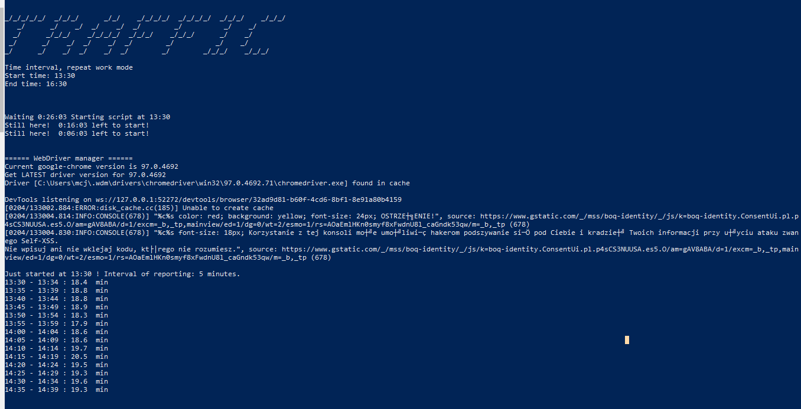
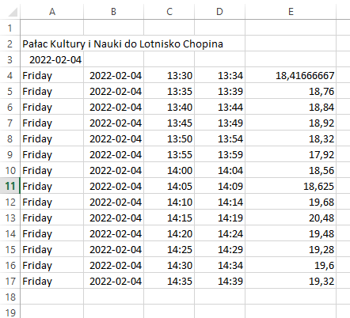

# Traffic Time - Google Maps Webscraper
> Webscraping commuting time from Google Maps for further analysis, meant for local use, created back when I have not been a professional yet.

## General info
Do you have flexible working hours - but you are tired of traffic just after you are finished for the day? Well, with this tool you can get information, when exactly travel time on your way home (or whatever road else) is in its highest and lowest.

The project uses Selenium to get lowest start-target commute time and saves averaged results in given interval in CSV file.

## Screenshots



## How it works
The script opens a given Google Maps route in a headless Chrome browser, reads the current travel time, and logs it every N minutes. Results are averaged over each interval and saved to a CSV. Supports scheduled start/end times for daily repeated runs.

## Requirements

- Python 3.10+
- Google Chrome installed

Install dependencies:

```bash
python3 -m venv .venv
source .venv/bin/activate
pip install -e .
```

## Configuration

All settings are read from environment variables. Copy `.env.example` from project root and rename it to `.env`. Fill at least the blank values (`GOOGLE_MAPS_URL`, `START_TIME`, `END_TIME`)

To get your URL: open **POLISH** Google Maps, set your route, and copy the URL from the browser.

```env
GOOGLE_MAPS_URL=https://www.google.pl/maps/dir/...   # your route URL from Google Maps
CSV_NAME=traffic_time.csv # your result filename

START_TIME=06:00          # when to start scraping (HH:MM)
END_TIME=10:00            # when to stop (only used if REPEAT=true)
REPEAT=true               # repeat daily in the given window, or run continuously
FORCED_START_NOW=false    # skip waiting and start immediately

INTERVAL_MINUTES=5        # how often to log an averaged result
SLEEP_TIME=5              # seconds between individual Google Maps queries
ENABLE_RAPORTING=true     # print current travel time to console
MAKE_SURE_IT_IS_WAITING=true  # print a heartbeat every 10 min while waiting to start
```

## Running

```bash
python main.py
```

## Output

Results are saved in the `results/` directory as a CSV (`;` delimited). Each row contains:

```
weekday ; date ; first_time ; last_time ; avg_travel_time_minutes
```

## Project structure

```
traffic/
├── main.py         # entry point and main loop
├── helpers.py      # utility functions (CSV, time, selenium init)
├── config.py       # pydantic-settings config, reads from .env
├── consts.py       # constants (XPaths, weekday names, logo)
├── pyproject.toml
└── .env            # your local config (not committed)
```

## Features
* Tracks time of travel from point A to point B
* Working in the background (headless mode)
* Notifications in console (can be disabled)
* Once set up the app is fully automatic
* Results are presented clearly in csv format - in form of dayOfWeek; date; startTime; endTime; averageTrafficTimeInGivenPeriod
* Microsoft Excel compatibility makes it easy to plot data
* Possibility to postpone start of script or forced start
* Continiuous webscraping or just in given time interval
* Webscraping frequency customization

### To-do list:
* Improve code quality and readability
* Development for other language versions of Google Maps
* Convert to serverless

## Other important information
* The application is meant to be used only with polish Google Maps
* Decimal separator is comma, not dot.

## Status
Project is: _in progress_

## Inspiration
Project inspired by my previous work, where traffic at 4 pm was insanely high. Thank you, previous work.

## Contact
Created purely by Maciej Konieczny for my needs and needs of whole world.
